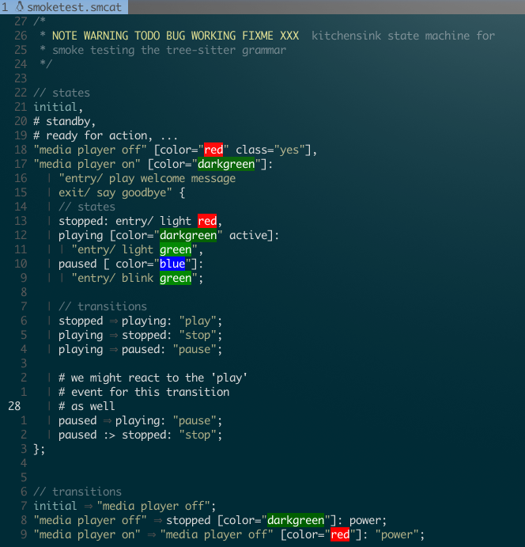
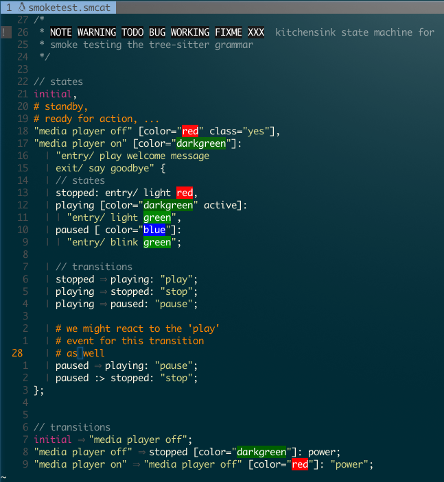
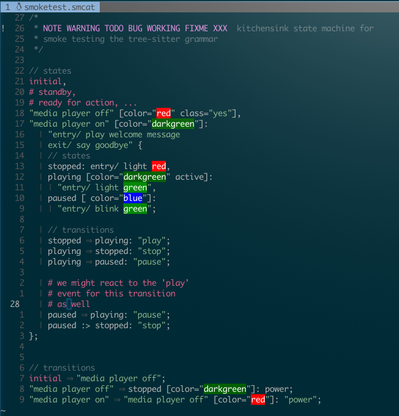

# vim-syntax-smcat

vim syntax file for smcat filetypes

## Install with Plug

```bash
    Plug 'ambagasdowa/vim-syntax-smcat'
```

## Screenshots

- Nord theme  
  
- Molokai theme  
  
- OneDark theme  
  
